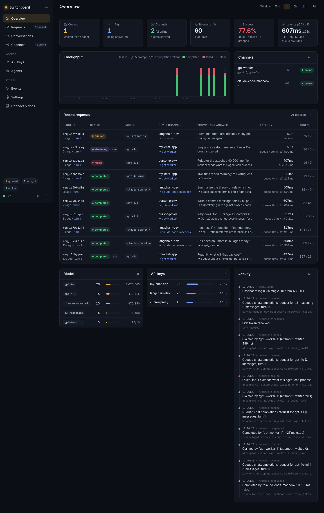
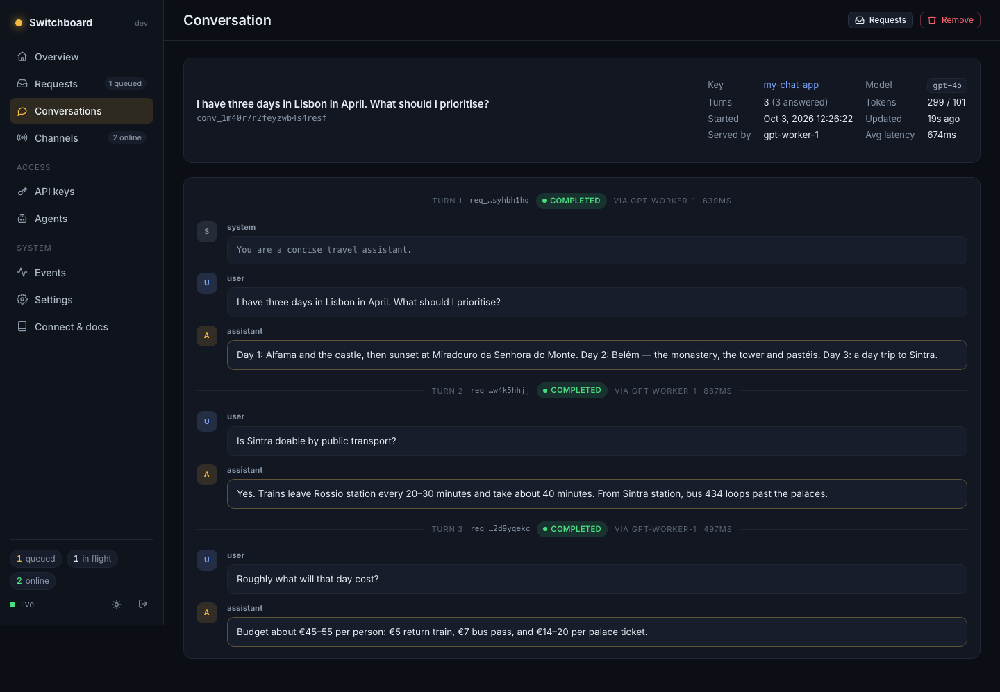
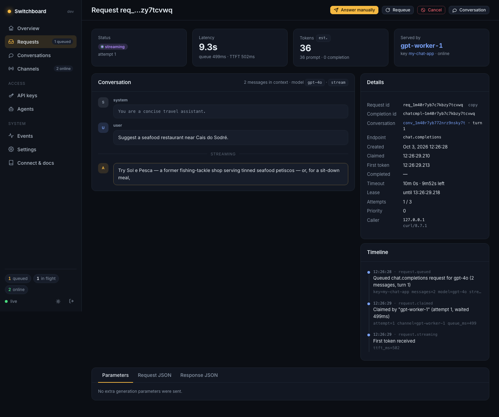

# Switchboard

An OpenAI-compatible API whose "model" is whatever agent you connect over MCP.

Applications call Switchboard exactly as they would call OpenAI. Instead of
running inference, Switchboard stores each request in a durable outbox and
exposes an MCP server. Agents (Claude Code, Claude Desktop, Cursor, your own
scripts, or a person at a keyboard) connect to that MCP server, claim
requests, and submit answers. Switchboard returns each answer to the waiting
caller as a normal OpenAI response, streaming included.

```
  your app ──POST /v1/chat/completions──▶ ┌─────────────┐ ◀──claim_request── agent A
  (OpenAI SDK, LangChain, curl, …)        │ Switchboard │ ──messages+params─▶ (channel)
            ◀──chat.completion / SSE───── │   SQLite    │ ◀─complete_request─ agent B
                                          └─────────────┘
                                   dashboard · CLI · event log
```

It is a single Go binary: HTTP API, MCP endpoint, OAuth server, web dashboard
(HTMX), terminal UI and CLI, backed by SQLite by default or an optional PostgreSQL database. No CGO, no external
services.



## Why you might want this

- **Put an agent behind any OpenAI-shaped app.** Point a tool that only speaks
  the OpenAI API at a coding agent, a subscription-backed assistant, or a
  custom pipeline.
- **Human in the loop.** Answer requests yourself from the dashboard or CLI
  while prototyping, red-teaming prompts, or building evaluation sets.
- **See exactly what an app sends.** Every request, parameter, tool definition
  and response is recorded and threaded into conversations.
- **Pool agents.** Several agents can serve one queue with per-model routing,
  concurrency limits, retries and failover.

## Install

After the first GitHub release is published, macOS and Linux users can install
without Go or sudo:

```sh
curl -fsSL https://raw.githubusercontent.com/ucgeorge/switchboard/main/scripts/install.sh | sh
```

Windows (PowerShell):

```powershell
irm https://raw.githubusercontent.com/ucgeorge/switchboard/main/scripts/install.ps1 | iex
```

Installers select your OS/CPU and verify SHA-256 checksums before installing.
Unix defaults to `~/.local/bin`; Windows uses `%LOCALAPPDATA%\Switchboard\bin`.
See [troubleshooting](docs/TROUBLESHOOTING.md) for PATH setup, upgrading, backups
and uninstalling. Pin a Unix version with `SWITCHBOARD_VERSION=0.1.0` or choose
an install directory with `SWITCHBOARD_INSTALL_DIR`. These release URLs become
available when source and a tagged release are published.

From a local source checkout, installation is already one command:

```sh
go install ./cmd/switchboard
```

For published source, Go users can also use:
`go install github.com/ucgeorge/switchboard/cmd/switchboard@latest`.

## Quick start

```bash
make build                 # Go 1.26.3+; sqlc only needed when editing SQL
./bin/switchboard          # starts the server with the terminal UI
```

The terminal shows the dashboard URL, a one-time login link, the OpenAI base
URL and the MCP URL. On first run it also prints a generated dashboard
password. Press `o` to open the dashboard, `l` for a fresh login link, `q` to
quit. Use `switchboard serve --headless` to run without the terminal UI.

**1. Create an API key for your app**

```bash
switchboard keys create --name my-app
export OPENAI_BASE_URL=http://127.0.0.1:8080/v1
export OPENAI_API_KEY=sk-sb-…
```

**2. Connect an agent**

```bash
switchboard mcp add claude-code     # creates a token and runs `claude mcp add`
switchboard skill install           # teaches Claude Code the serving loop
```

Then tell the agent: *"serve Switchboard requests"*. For other clients, print
ready-to-paste configuration with `switchboard mcp config cursor` (also
`claude-desktop`, `windsurf`, `vscode`, `codex`, `json`). OAuth-capable clients
can simply add `http://127.0.0.1:8080/mcp` and approve access in the browser.

**3. Send a request**

```bash
curl $OPENAI_BASE_URL/chat/completions \
  -H "Authorization: Bearer $OPENAI_API_KEY" -H "Content-Type: application/json" \
  -d '{"model":"switchboard/auto","messages":[{"role":"user","content":"Hello!"}]}'
```

The call blocks until an agent answers. No agent handy? Answer it yourself:

```bash
switchboard requests pending
switchboard requests answer req_… --text "Hello! How can I help?"
```

`switchboard send "What is 2+2?"` queues a test request and waits for the
reply, which is a quick way to check an agent is serving.

## How it works

### Request lifecycle

`queued → claimed → streaming → completed`, or `failed`, `cancelled`,
`expired`.

1. A caller sends a chat completion. Switchboard authenticates the API key,
   applies rate limits, links the request to a conversation, and queues it.
2. An agent's `claim_request` call long-polls and receives the oldest,
   highest-priority request its channel is eligible for. Claiming is an atomic
   update, so a request is never handed to two agents.
3. The agent optionally streams with `stream_delta` and finishes with
   `complete_request`. The caller receives the OpenAI response.

### Channels and routing

A **channel** is one connected agent instance, created by the agent with
`open_channel` (name, models it serves, concurrency). Routing is pull-based:
whichever eligible channel asks next gets the next request, which balances
load without a scheduler. A channel is eligible when

- it serves the requested model (`*`, exact name, or a glob such as `gpt-4*`),
- it is below its concurrency limit and not draining,
- the request's API key is not pinned to a different channel.

Higher-priority API keys are served first; within a priority, oldest first.

### Conversations

OpenAI clients resend the whole history on every call. Switchboard uses that
to rebuild threads: it hashes each request's messages plus the answer it
returned, and when a later request's history matches that hash, the request is
appended to the same conversation. Tool-call rounds are handled the same way.
The dashboard shows each conversation as one thread with the channel, latency
and status of every turn.



## The OpenAI-compatible API

| Endpoint | Notes |
| --- | --- |
| `POST /v1/chat/completions` | Streaming (SSE) and non-streaming. Tools, `tool_calls`, `response_format` and every other parameter are forwarded to the agent untouched. |
| `POST /v1/completions` | Legacy prompt API, converted to a chat request. |
| `GET /v1/models`, `GET /v1/models/{id}` | Models from Settings plus those declared by open channels. |
| `GET /v1/requests/{id}` | Extension: poll the state of a request you submitted. |

Authenticate with `Authorization: Bearer sk-sb-…` (or `X-Api-Key`). Responses
carry `x-switchboard-request-id` and `x-switchboard-conversation-id`. Errors
use the OpenAI envelope:

| Status | `code` | Meaning |
| --- | --- | --- |
| 401 | `invalid_api_key`, `api_key_revoked`, `missing_api_key` | Authentication |
| 403 | `model_not_allowed` | Key is restricted to other models |
| 404 | `model_not_found` | Only when "accept any model" is off |
| 429 | `rate_limit_exceeded`, `queue_full` | Backpressure; see `Retry-After` |
| 502 | `agent_error` | The agent failed the request |
| 503 | `request_cancelled` | Cancelled by an operator |
| 504 | `timeout` | No agent answered before the deadline |

Token usage is estimated from text length unless the agent reports real
counts; estimated values are marked in the dashboard.

## Serving as an agent (MCP)

Endpoint: `http://127.0.0.1:8080/mcp` (Streamable HTTP).

| Tool | Purpose |
| --- | --- |
| `open_channel` | Register this agent instance; returns `channel_id`. |
| `claim_request` | Long-poll for the next request (`wait_seconds`, default 25). Returns messages, params, deadline. |
| `stream_delta` | Send partial text or tool calls to the caller now; renews the lease. |
| `complete_request` | Deliver the final answer (`content`, `tool_calls`, `finish_reason`, `usage`). |
| `fail_request` | `retryable: true` requeues for another agent; `false` fails the caller. |
| `release_request` | Hand a claimed request back without blame. |
| `extend_lease`, `heartbeat` | Keep a long-running request or an idle channel alive. |
| `get_request`, `queue_status`, `list_channels`, `close_channel` | Visibility and cleanup. |

The loop is: `open_channel` once, then `claim_request` → answer →
`complete_request`, repeated. The same instructions are available to agents as
the MCP prompt `serve`, the resource `switchboard://guide`, and the installable
skill (`switchboard skill print`).

### Authentication

- **Agent tokens** (`switchboard tokens create`, or Agents in the dashboard):
  static bearer tokens, shown once, stored hashed, revocable.
- **OAuth 2.1**: authorization-code flow with PKCE (S256), dynamic client
  registration (RFC 7591), authorization-server and protected-resource
  metadata (RFC 8414, RFC 9728), refresh-token rotation and revocation
  (RFC 7009). Consent requires the dashboard login. An unauthenticated call to
  `/mcp` returns `401` with a `WWW-Authenticate` header pointing at the
  metadata, so compliant clients discover everything automatically.

Each channel belongs to the token that opened it; another token cannot claim
or complete on it.

## Dashboard

Overview (live gauges, throughput, latency percentiles, per-model and per-key
usage), Requests (filter and search, live), request detail (messages, live
streaming output, parameters, raw JSON, timeline, cancel/requeue/answer),
Conversations (reconstructed threads), Channels (status, drain, close), API
keys, Agents (tokens and OAuth clients), Events, Settings, and connection
docs. Pages update over a server-sent event stream; there is nothing to
refresh. Light and dark themes.

Sign in with the dashboard password or a one-time link
(`switchboard auth login-link`).



## Remote instances

Manage a remote deployment with `--url https://switchboard.example.com` and
`SWITCHBOARD_ADMIN_TOKEN`. MCP registration uses that remote instance while
configuring your local agent client. See [remote operation](docs/REMOTE.md)
for credential setup, command behavior, event following, and backup downloads.

## CLI

Management commands read and write the database directly, so they work
whether or not the server is running, and a running server picks changes up
within a couple of seconds. Add `--json` to any listing for machine output.

```
switchboard [serve]                 start the server (TUI; --headless, --open, --addr)
switchboard keys      list | create | revoke | delete
switchboard tokens    list | create | revoke | delete
switchboard channels  list | show | drain | resume | close | delete
switchboard requests  list | pending | show | answer | cancel | requeue
switchboard conversations  list | show
switchboard send <prompt>           queue a test request and wait for the reply
switchboard events    list | tail
switchboard stats     [-w 24h]
switchboard settings  list | get | set
switchboard auth      set-password | login-link | logout-all
switchboard mcp       url | config [client] | add claude-code
switchboard skill     install | print
switchboard db        path | backup | prune | vacuum
```

## Configuration

Process flags and environment:

| Flag | Environment | Default |
| --- | --- | --- |
| `--addr` | `SWITCHBOARD_ADDR` | `127.0.0.1:8080` |
| `--db` | `SWITCHBOARD_DB` | `~/.switchboard/switchboard.db` |
| | `SWITCHBOARD_DATA_DIR` | `~/.switchboard` |
| `--log-level` | `SWITCHBOARD_LOG_LEVEL` | `info` |

Runtime settings (dashboard → Settings, or `switchboard settings set`):

| Key | Default | Effect |
| --- | --- | --- |
| `request_timeout_seconds` | 600 | How long a caller waits before `504`. Overridable per key. |
| `lease_seconds` | 120 | Time an agent may hold a request without progress. |
| `channel_stale_seconds` | 90 | Silence after which a channel is marked offline. |
| `max_attempts` | 3 | Claims before a request fails permanently. |
| `max_queue_depth` | 0 | Reject with `429` beyond this many queued (0 = unlimited). |
| `default_rate_limit_rpm` | 0 | Requests per minute for keys without their own limit. |
| `models` | `switchboard/auto` | Models advertised by `/v1/models`. |
| `accept_any_model` | true | Queue requests for models no channel has declared. |
| `retention_days` | 30 | Age at which finished requests and events are pruned. |
| `public_url` | (empty) | External base URL when behind a tunnel or proxy. |
| `oauth_access_ttl_seconds`, `oauth_refresh_ttl_seconds`, `session_ttl_days`, `stream_keepalive_seconds`, `instance_name` | | |

## Reliability model

- **Durable outbox.** Requests live in SQLite (WAL). Nothing is lost when an
  agent disconnects.
- **Leases.** A claimed request must show progress within the lease or it is
  requeued for another agent, up to `max_attempts`.
- **No duplicate output.** Once tokens have been streamed to a caller the
  request is never re-run by another agent; it fails instead.
- **Deadlines.** Every request has a timeout; the agent sees the deadline in
  the claim.
- **Cancellation.** A caller that disconnects cancels its request, and the
  agent's next call says so.
- **Stale channels.** A silent channel goes offline and its work is requeued.
- **Restarts.** On startup, requests whose callers were lost are cancelled and
  channels are marked offline until their agents return.
- **Everything is an event.** State changes are written to the event log
  before any live subscriber is told, so timelines never lag what you see.

## Security model

- Loopback by default. API keys, agent tokens, OAuth tokens and sessions are
  stored as SHA-256 hashes; the dashboard password uses argon2id. Secrets are
  displayed once, at creation.
- Dashboard sessions are `HttpOnly`, `SameSite=Lax` cookies; state-changing
  requests require a CSRF token; login attempts are rate-limited per address.
- OAuth requires PKCE, exact redirect-URI matching and single-use
  authorization codes. Refresh tokens rotate.
- The MCP endpoint rejects DNS-rebinding attempts on localhost.

## Reaching it from elsewhere

Switchboard does not terminate TLS. To use it from another machine or from a
hosted client, put it behind a tunnel or reverse proxy (`cloudflared`,
`ngrok`, Tailscale Serve, Caddy, nginx) and set `public_url` to the external
address so OAuth metadata and MCP resource identifiers are correct:

```bash
switchboard settings set public_url https://switchboard.example.com
```

The dashboard stays behind its login; API keys and agent tokens are unchanged.
Use a strong dashboard password before exposing it.

## Limitations

- Single operator: one dashboard password, no user accounts or roles.
- `/v1/embeddings`, the Responses API, images and audio endpoints are not
  implemented. `n > 1` is rejected.
- Live token-by-token streaming in the dashboard is per server process; an
  answer submitted from the CLI reaches the caller within about two seconds.
- Throughput is bounded by SQLite's single writer. That is far more than a
  pool of agents will produce, but this is not a high-QPS gateway.

## Development

```
cmd/switchboard        entry point
internal/core          domain: keys, tokens, OAuth, channels, broker, conversations, stats
internal/api           OpenAI-compatible HTTP handlers
internal/mcpserver     MCP tools, prompt, resources, bearer auth
internal/oauth         OAuth 2.1 authorization server endpoints
internal/web           dashboard (templates, static assets, handlers)
internal/tui           terminal UI          internal/cli   commands
internal/db            migrations, sqlc queries and generated code
internal/openai        wire types, conversation hashing
internal/events        event bus
```

```bash
make generate   # regenerate internal/db/sqlcgen after editing SQL
make test       # go test ./...
make dev        # run headless from source
```

Tests cover the broker (claims, leases, retries, routing, conversation
linking), the HTTP API end to end (streaming, cancellation, rate limits), the
MCP server through a real client transport, the OAuth flow, and dashboard
rendering, authentication and CSRF.

## Project

Licensed under [MIT](LICENSE). See [third-party notices](THIRD_PARTY_NOTICES.md),
[contributing](CONTRIBUTING.md), [security](SECURITY.md),
[changelog](CHANGELOG.md), and [release procedures](docs/RELEASING.md).

## Documentation website

The open-source Astro/Starlight site in `website/` provides a custom landing
page and 25 operator guides, with search, themed navigation and cross-links.
It builds to static files and deploys automatically through `.github/workflows/pages.yml`.
Enable GitHub Pages with **GitHub Actions** as the source before the first deployment.
The project subpath is derived from the repository name; no paid hosting is needed.

```sh
cd website
npm ci
npm run dev
# Production validation:
npm run build && npm run check
```

## Compose, PostgreSQL and Keel

`docker compose up -d --build --wait` runs the SQLite default. Add
`-f compose.yaml -f compose.postgres.yaml` for bundled PostgreSQL after setting
`POSTGRES_PASSWORD` in `.env`. Use `SWITCHBOARD_DATABASE_URL` for an existing
PostgreSQL service. See [self-hosting](docs/SELF_HOSTING.md).

[Keel](https://keel-cloud.mintlify.site/) provides the `compose-ssh` deployment
for existing hardware, Oracle Always Free, or another Linux VPS. This replaces
the proposed Vercel runtime target. `keel validate` checks its typed configuration.
The public landing page and docs remain on GitHub Pages; exact setup is in
[Pages setup](docs/GITHUB_PAGES.md).
